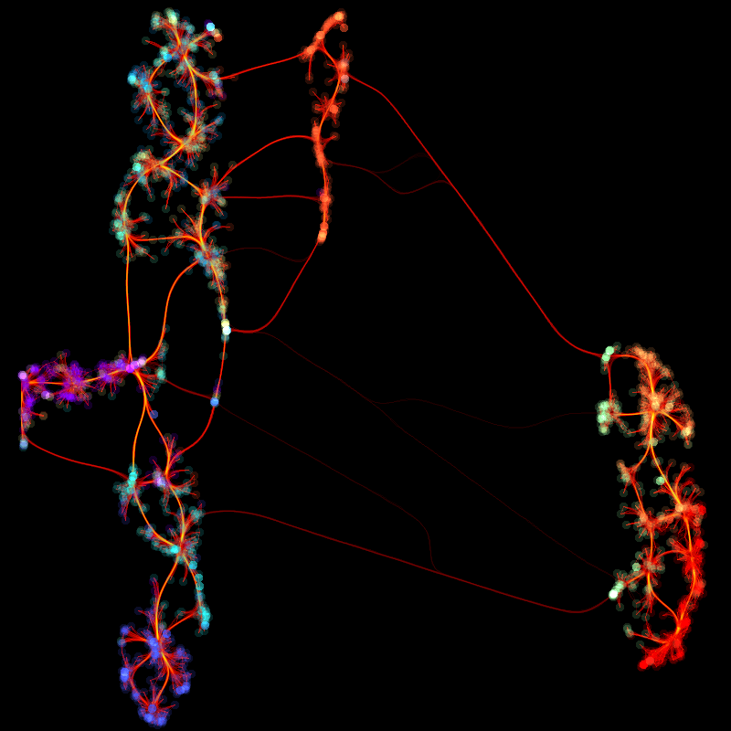

This repository shows how to make pictures like the one above. 

This simple repo contains code for training a VAE on fashion MNIST data and 
then using the encoder from the VAE to generate features for each fashion
MNIST image. These are then used as the inputs for the UMAP projection.
The latter relies heavily on the excellent [`umap-learn`](https://github.com/lmcinnes/umap)
python library.

### Set up the environment
Clone this repository somewhere:
```bash
git clone https://github.com/dhudsmith/nnet_umap.git
```

With anaconda installed, navigate to the project root and execute
```bash
conda env create -f environment.yml
```

To start the environment, execute
```bash
conda activate nnet_umap
```
Use `conda deactivate` to exit.

### Starting jupyter
Within the conda environment, execute
```bash
jupyter lab
```
Jupyter should open in your default browser. If not, 
follow the link in your terminal.

### Training the VAE
You can optionally run through `train_vae.ipynb` jupyter notebook to train the VAE yourself
using the fashion-MNIST dataset. A pretrained encoder 
is available in the `models/` folder, so you can skip this unless you want to 
customize the model or use a different dataset.

### Generating the graphic
Run through `umap_projection.ipynb` to generate the visual. Note the settings at the top
these control the number of data points used, the color scheme, 
the resolution, and the size of data points. The code can take an hour or more
run if you use lots of data points. The default parameters should run in a few minutes
on most machines. If all goes well, you should get something like this with default settings:


